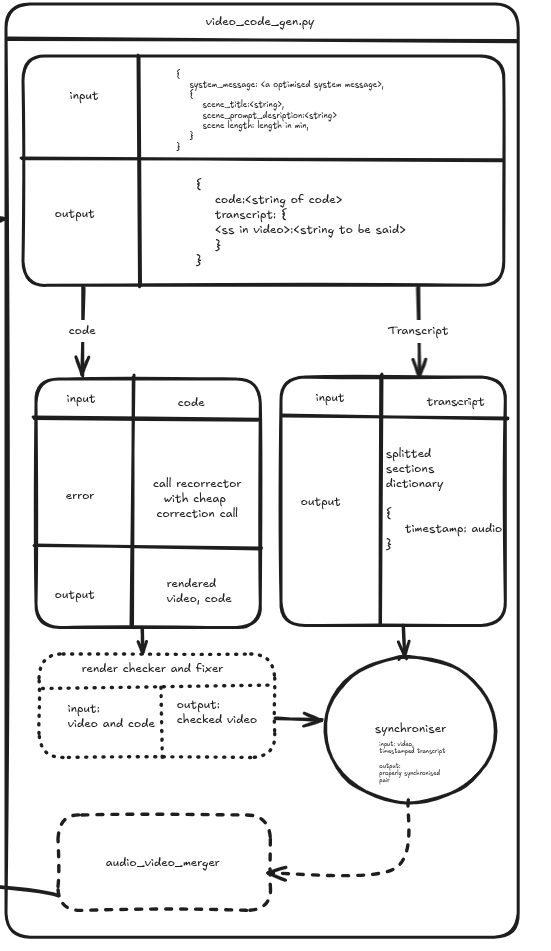

# Manim Graph RAG Agent

A Graph RAG-powered LangGraph agent for generating and compiling Manim animations.

## Quick Start

```bash
# Build and run
docker-compose up -d

# Index the dataset
docker-compose exec app python -m src.main index --data "./extracted data"

# Generate animation
docker-compose exec app python -m src.main generate --prompt "Animate a circle" --output ./output
```


## Demo


<video src="assets/output.mp4" controls width="100%"></video>

## Architecture



- **Graph RAG**: Neo4j + ChromaDB hybrid retrieval
- **Agent**: LangGraph StateGraph workflow
- **Renderer**: Manim inside Docker

## Development

```bash
pip install -r requirements.txt
python -m src.main --help
```
