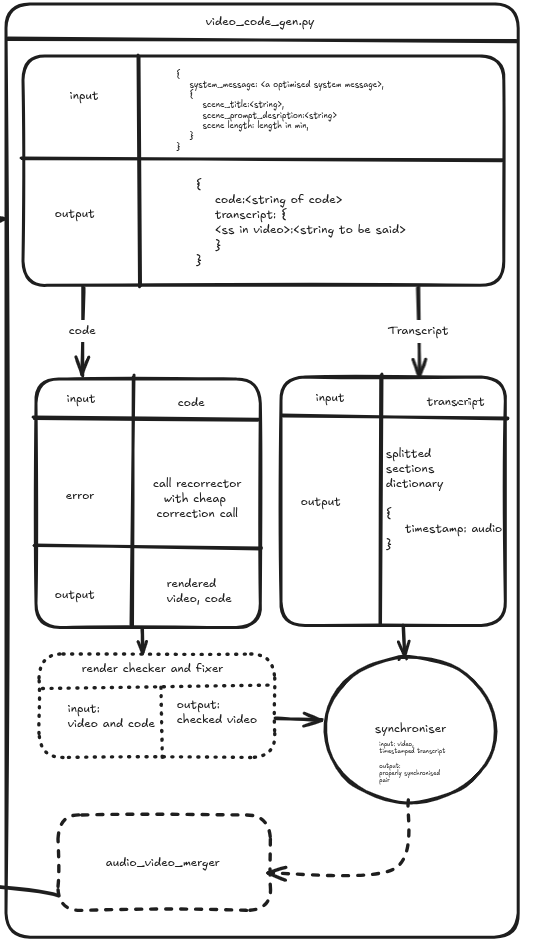
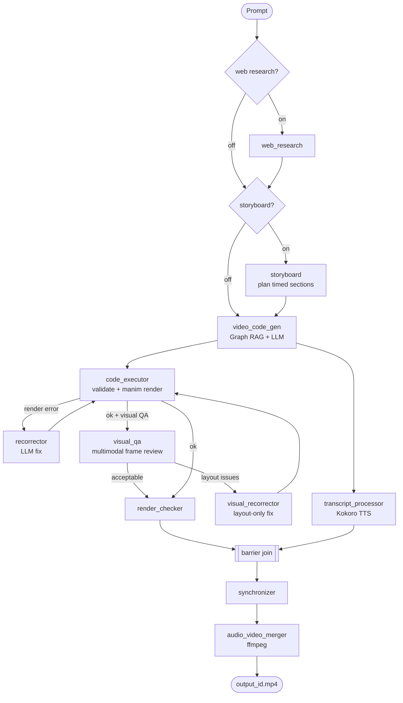

<div align="center">

# Logomotion

**Type a sentence. Get a narrated math animation.**

*An agentic pipeline that plans, writes, renders, reviews, and voices Manim animations — from a single natural-language prompt.*

[](https://www.python.org/)
[](https://www.manim.community/)
[](https://github.com/langchain-ai/langgraph)
[](https://fastapi.tiangolo.com/)
[](https://vuejs.org/)
[](https://neo4j.com/)
[](https://github.com/thewh1teagle/kokoro-onnx)
[](LICENSE)

[Demo 1](https://github.com/Arc-001/Logomotion/raw/main/assets/1.mp4) ·
[Demo 2](https://github.com/Arc-001/Logomotion/raw/main/assets/2.mp4) ·
[Demo 3](https://github.com/Arc-001/Logomotion/raw/main/assets/3.mp4)

</div>

---

## What it does

You give it *"Explain the concept of binary search"*. It hands back a rendered, narrated video — storyboarded, code-generated, visually reviewed, and voiced without a single audio API call.

<div align="center">


</div>

Logomotion is not a single LLM call wearing a trench coat. It is a self-correcting **LangGraph state machine** that:

- **Plans first.** A storyboard stage breaks the video into timed sections before a line of code exists.
- **Steals like an artist.** Hybrid Graph RAG retrieval (ChromaDB vectors + Neo4j graph traversal) pulls in real Manim examples related to your topic.
- **Fails fast.** Generated code is statically validated in milliseconds — syntax errors never burn a two-minute render timeout.
- **Fixes itself.** Render errors loop through an LLM corrector; with visual QA enabled, the multimodal model *looks at the rendered frames*, spots overlapping or off-screen elements, and re-renders with a layout fix.
- **Speaks for itself.** Narration is synthesized locally with Kokoro (82M params, CPU-only) — no audio API bills.
- **Cleans up.** Output lands in `output/`, temp artifacts are removed, and anything non-fatal is reported as a warning instead of being swallowed.

## Architecture




```mermaid
flowchart TD
    P([Prompt]) --> E{web research?}
    E -- on --> WR[web_research]
    E -- off --> SB
    WR --> SB{storyboard?}
    SB -- on --> ST["storyboard<br/>plan timed sections"]
    SB -- off --> CG
    ST --> CG["video_code_gen<br/>Graph RAG + LLM"]

    CG --> CE["code_executor<br/>validate + manim render"]
    CG --> TP["transcript_processor<br/>Kokoro TTS"]

    CE -- render error --> RC["recorrector<br/>LLM fix"] --> CE
    CE -- ok + visual QA --> VQ["visual_qa<br/>multimodal frame review"]
    VQ -- layout issues --> VR["visual_recorrector<br/>layout-only fix"] --> CE
    VQ -- acceptable --> RCH
    CE -- ok --> RCH[render_checker]

    RCH --> B[[barrier join]]
    TP --> B
    B --> SY[synchronizer] --> M["audio_video_merger<br/>ffmpeg"] --> OUT([output_id.mp4])
```

| Stage | Role |
|---|---|
| `storyboard` | Plans the video as timed sections (title, duration, visuals, narration) before any code is written |
| `video_code_gen` | Hybrid retrieval guided by class/animation hints mined from the prompt, then one constrained LLM call for code + transcript |
| `code_executor` | Static validation (syntax, scene class, removed APIs), then `manim render` at the configured quality |
| `recorrector` | Feeds render errors back to the LLM, up to `MAX_RETRIES` times |
| `visual_qa` | Samples frames, asks the multimodal LLM for a strict-JSON layout verdict, triggers a timing-preserving fix and re-render |
| `transcript_processor` | Splits the transcript and synthesizes each segment locally |
| `render_checker` | Integrity, resolution, codec, and duration checks |
| `synchronizer` + `audio_video_merger` | Barrier-joined finale: aligns timestamps, builds the narration track, muxes with ffmpeg, persists, cleans up |

## Quickstart

```bash
git clone https://github.com/Arc-001/Logomotion.git
cd Logomotion
./start.sh install     # venv + deps + .env template
# edit .env: add your OpenRouter API key
./start.sh start       # Neo4j up (auto-seeded) + API server
```

Or skip straight to containers:

```bash
./start.sh install --docker
./start.sh start --docker
```

One script drives the entire lifecycle:

| Command | What it does |
|---|---|
| `./start.sh install [--docker]` | Install deps (venv + pip, or build Docker images) |
| `./start.sh start [--docker]` | Start Neo4j (auto-seeded) and the API server |
| `./start.sh stop` | Stop all containers (data volumes preserved) |
| `./start.sh seed [--force]` | Load the bundled Neo4j dump; `--force` wipes and re-seeds |
| `./start.sh generate "prompt"` | Generate a video |
| `./start.sh serve` / `index` / `test` / `logs` / `status` | The rest of the toolbox |

> [!NOTE]
> The Docker setup ships **pre-seeded**: on first start, a one-shot `neo4j-seed` service loads `neo4j-dumps/neo4j.dump` (about 1200 Manim examples with concept, class, and animation graph links) into the database. No manual indexing required. Delete the `neo4j_data` volume to re-seed.

The API and web UI come up at `http://localhost:8000`, the Neo4j browser at `http://localhost:7474`.

## Usage

### Command line

```bash
./start.sh generate "Red-Black Tree insertion" -l 3.0 -d comprehensive -q high --visual-qa -o ./output
```

| Flag | Description | Default |
|---|---|---|
| `-l`, `--length` | Target video length in minutes | `1.0` |
| `-d`, `--depth` | `basic`, `detailed`, `comprehensive` | `detailed` |
| `-t`, `--title` | Scene title | `Generated Scene` |
| `-q`, `--quality` | `low` (480p), `medium` (720p), `high` (1080p) | `medium` |
| `--fps` | Frame rate override | manim default |
| `--orientation` | `landscape` or `portrait` | `landscape` |
| `--duration-mode` | `guide` (soft target) or `strict` (ffmpeg speed adjust) | `guide` |
| `--visual-qa` | Review rendered frames and auto-fix layout | off |
| `-o`, `--output` | Also copy code + video to this directory | none |

> [!TIP]
> `--visual-qa` is the single biggest quality lever. It costs one vision call and, when problems are found, one extra render — and it catches the classic Manim sins: overlapping labels, text running off-frame, and scenes that fade into nothing.

### Web UI

`./start.sh serve` and open `http://localhost:8000`. Every CLI knob is in the form — including live web research and the visual QA pass — plus per-job status, warnings, generated code, and a download button.

### REST API

```bash
curl -X POST localhost:8000/generate \
  -H "Content-Type: application/json" \
  -d '{"topic": "How quicksort works", "length": 2.0, "quality": "high", "visual_qa": true}'
```

<details>
<summary><b>Full endpoint reference</b></summary>

#### POST /generate

| Field | Type | Required | Description |
|---|---|---|---|
| `topic` | string | yes (or `prompt`) | Subject of the video |
| `prompt` | string | yes (or `topic`) | Alias for `topic`; provide either one |
| `length` | float | no | Target length in minutes (0.1 to 30.0) |
| `depth` | string | no | `basic`, `detailed`, or `comprehensive` |
| `title` | string | no | Scene title |
| `orientation` | string | no | `landscape` or `portrait` |
| `duration_mode` | string | no | `guide` or `strict` |
| `quality` | string | no | `low`, `medium`, or `high` |
| `fps` | int | no | Frame rate override (5 to 60) |
| `web_search` | bool | no | Ground the animation in live web research |
| `visual_qa` | bool | no | Review rendered frames and auto-fix layout |

Returns `{"job_id": "...", "status": "pending"}` immediately.

#### GET /jobs/{job_id}

`status` is one of `pending`, `running`, `completed`, `failed`. Non-fatal issues surface in `warnings`:

```json
{
  "job_id": "a1b2c3d4",
  "status": "completed",
  "video_path": "output/output_a1b2c3d4.mp4",
  "code": "from manim import *\n...",
  "error": null,
  "warnings": ["Duration mismatch: video is 25% longer than target (75.0s vs 60.0s)"]
}
```

#### Everything else

| Method and path | Description |
|---|---|
| `GET /jobs/{job_id}/download` | Download the finished video (`video/mp4`) |
| `GET /search?query=...&limit=5` | Search the indexed Manim examples |
| `GET /health` | Health check |

</details>

## Configuration

Everything lives in `.env` — copy `.env.example` and go. The highlights:

| Variable | What it controls | Default |
|---|---|---|
| `OPENROUTER_API_KEY` | The only key you need | required |
| `OPENROUTER_MODEL` | Any OpenAI-compatible multimodal model | `google/gemini-3-flash-preview` |
| `RENDER_QUALITY` | `low` / `medium` / `high` (or manim's `l`/`m`/`h`/`p`/`k`) | `medium` |
| `STORYBOARD_ENABLED` | Plan-before-code stage | `true` |
| `VISUAL_QA_ENABLED` | Frame review + layout auto-fix for every job | `false` |
| `DURATION_MODE` | `guide` (natural pacing) or `strict` (exact length) | `guide` |

<details>
<summary><b>Complete variable reference</b></summary>

| Variable | Description | Default |
|---|---|---|
| `OPENROUTER_API_KEY` | API key for the LLM provider | required |
| `OPENROUTER_MODEL` | Model identifier | `google/gemini-3-flash-preview` |
| `OPENROUTER_BASE_URL` | Base URL for the API | `https://openrouter.ai/api/v1` |
| `LLM_RETRIES` | LLM call retries with exponential backoff | `3` |
| `VIDEO_LENGTH` | Default target video length in minutes | `1.0` |
| `EXPLANATION_DEPTH` | `basic`, `detailed`, or `comprehensive` | `detailed` |
| `VIDEO_ORIENTATION` | `landscape` or `portrait` | `landscape` |
| `DURATION_MODE` | `guide` or `strict` | `guide` |
| `MAX_RETRIES` | Maximum render error-correction attempts | `3` |
| `RENDER_TIMEOUT` | Render timeout in seconds | `120` |
| `RENDER_QUALITY` | Render quality | `medium` |
| `RENDER_FPS` | Frame rate override | manim default |
| `STORYBOARD_ENABLED` | Plan timed sections before generating code | `true` |
| `VISUAL_QA_ENABLED` | Multimodal frame review with layout auto-fix | `false` |
| `VISUAL_QA_MAX_ATTEMPTS` | Layout-fix re-render attempts per job | `1` |
| `VISUAL_QA_FRAMES` | Frames sampled per review | `6` |
| `NEO4J_URI` | Neo4j Bolt URI | `bolt://localhost:7687` |
| `NEO4J_USER` | Neo4j username | `neo4j` |
| `NEO4J_PASSWORD` | Neo4j password | `password` |
| `CHROMA_PERSIST_DIRECTORY` | ChromaDB storage path | `./chroma_db` |
| `CORS_ALLOW_ORIGINS` | Comma-separated allowed origins | localhost dev origins |

</details>

## Project structure

<details>
<summary><b>Where everything lives</b></summary>

```
Logomotion/
  src/
    main.py              CLI entry point (index / generate / serve)
    api.py               FastAPI server and web UI host
    config.py            Centralized settings loaded from .env
    agent/
      graph.py           LangGraph state machine builder
      nodes.py           Workflow nodes (planning, generation, QA, merge)
      state.py           State type definitions
    graph_rag/
      indexer.py         JSONL dataset indexer (Neo4j + ChromaDB)
      retriever.py       Hybrid search (vector + graph traversal)
      embeddings.py      OpenRouter embedding function
      schema.py          Graph schema definitions
    manim_runner/
      executor.py        Manim subprocess execution
      validator.py       Static code validation and video integrity checks
      frames.py          Frame extraction for visual QA
    search/
      web.py             Live web research (DuckDuckGo + Wikipedia)
    tts/                 Kokoro TTS wrapper
  frontend/              Vue 3 web interface (built assets in src/static/)
  tests/                 Unit tests (no live databases or API keys required)
  neo4j-dumps/           Pre-indexed knowledge base dump for Docker seeding
  extracted data/        JSONL dataset for indexing
  docker-compose.yml     Application, Neo4j, and seed services
  start.sh               Single entry point script
  install.sh             Installation script
```

</details>

## Development

```bash
./start.sh test        # 92 tests, no DBs, no network, no API key
```

The frontend is Vue 3 + Vite. `npm run dev` proxies API calls to a local server; production builds are committed to `src/static/`:

```bash
cd frontend && npm run build && cp -r dist/* ../src/static/
```

> [!IMPORTANT]
> Requirements: Python 3.10+, ffmpeg, Manim's system packages (`libcairo2-dev`, `libpango1.0-dev`, a LaTeX distribution — see the `Dockerfile`), and an OpenRouter API key. Neo4j comes free with the Docker setup.

## License

[MIT](LICENSE) — go make something move.

---

<div align="center">

**[Architecture](#architecture)** · **[Quickstart](#quickstart)** · **[Usage](#usage)** · **[Configuration](#configuration)** · **[Development](#development)**

<sub>Prompt in, motion picture out. If it drew a triangle where you asked for a proof, open an issue.</sub>

<a href="#logomotion">Back to top</a>

</div>
